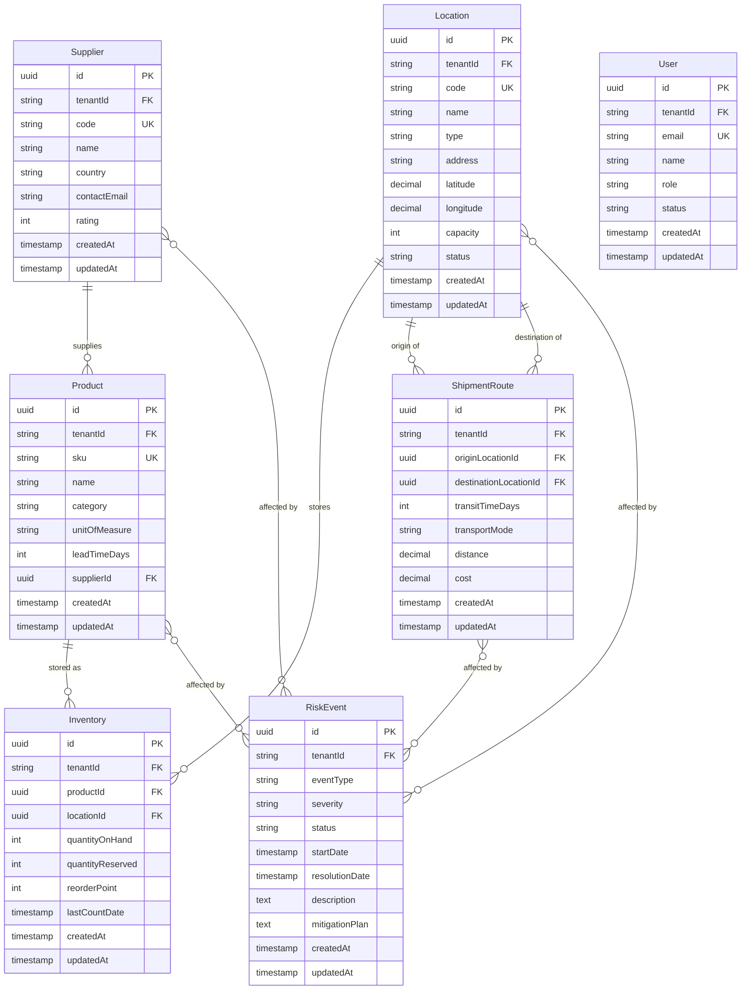

# Data Model: Supply Chain Risk & Disruption Predictor

**Feature**: Data Model & Database Schema
**Branch**: `002-data-model-schema`
**Date**: 2025-11-29
**Database**: PostgreSQL 16
**ORM**: Prisma 6.x

## Overview

This document defines the complete data model for the Supply Chain Risk & Disruption Predictor platform, including all entities, relationships, constraints, and indexes.

## Entity Relationship Diagram



## Complete Prisma Schema

```prisma
// backend/prisma/schema.prisma

generator client {
  provider = "prisma-client-js"
}

datasource db {
  provider = "postgresql"
  url      = env("DATABASE_URL")
}

// =======================
// Core Entities
// =======================

model Supplier {
  id           String   @id @default(uuid())
  tenantId     String   @map("tenant_id")
  code         String   @unique
  name         String
  country      String
  contactEmail String?  @map("contact_email")
  contactPhone String?  @map("contact_phone")
  address      String?
  rating       Int      @default(3) // 1-5 scale
  notes        String?  @db.Text

  createdAt    DateTime @default(now()) @map("created_at")
  updatedAt    DateTime @updatedAt @map("updated_at")

  // Relationships
  products     Product[]
  riskEvents   RiskEventSupplier[]

  @@index([tenantId])
  @@index([country])
  @@index([rating])
  @@map("suppliers")
}

model Product {
  id             String   @id @default(uuid())
  tenantId       String   @map("tenant_id")
  sku            String   @unique
  name           String
  description    String?  @db.Text
  category       String
  unitOfMeasure  String   @default("unit") @map("unit_of_measure")
  leadTimeDays   Int      @map("lead_time_days")

  supplierId     String   @map("supplier_id")
  supplier       Supplier @relation(fields: [supplierId], references: [id], onDelete: Restrict)

  createdAt      DateTime @default(now()) @map("created_at")
  updatedAt      DateTime @updatedAt @map("updated_at")

  // Relationships
  inventory      Inventory[]
  riskEvents     RiskEventProduct[]

  @@index([tenantId])
  @@index([supplierId])
  @@index([category])
  @@map("products")
}

model Location {
  id            String   @id @default(uuid())
  tenantId      String   @map("tenant_id")
  code          String   @unique
  name          String
  type          LocationType
  address       String?
  city          String?
  state         String?
  country       String
  postalCode    String?  @map("postal_code")
  latitude      Decimal? @db.Decimal(10, 7)
  longitude     Decimal? @db.Decimal(10, 7)
  capacity      Int?
  status        LocationStatus @default(ACTIVE)

  createdAt     DateTime @default(now()) @map("created_at")
  updatedAt     DateTime @updatedAt @map("updated_at")

  // Relationships
  inventory            Inventory[]
  routesAsOrigin       ShipmentRoute[] @relation("OriginLocation")
  routesAsDestination  ShipmentRoute[] @relation("DestinationLocation")
  riskEvents           RiskEventLocation[]

  @@index([tenantId])
  @@index([type])
  @@index([country])
  @@index([status])
  @@map("locations")
}

model ShipmentRoute {
  id                    String   @id @default(uuid())
  tenantId              String   @map("tenant_id")

  originLocationId      String   @map("origin_location_id")
  originLocation        Location @relation("OriginLocation", fields: [originLocationId], references: [id], onDelete: Restrict)

  destinationLocationId String   @map("destination_location_id")
  destinationLocation   Location @relation("DestinationLocation", fields: [destinationLocationId], references: [id], onDelete: Restrict)

  transitTimeDays       Int      @map("transit_time_days")
  transportMode         TransportMode @map("transport_mode")
  distance              Decimal? @db.Decimal(10, 2) // in kilometers
  cost                  Decimal? @db.Decimal(12, 2) // in USD

  createdAt             DateTime @default(now()) @map("created_at")
  updatedAt             DateTime @updatedAt @map("updated_at")

  // Relationships
  riskEvents            RiskEventRoute[]

  @@index([tenantId])
  @@index([originLocationId])
  @@index([destinationLocationId])
  @@index([transportMode])
  @@unique([tenantId, originLocationId, destinationLocationId, transportMode], name: "unique_route")
  @@map("shipment_routes")
}

model RiskEvent {
  id              String   @id @default(uuid())
  tenantId        String   @map("tenant_id")
  eventType       EventType @map("event_type")
  severity        RiskSeverity
  status          RiskStatus @default(ACTIVE)

  startDate       DateTime @map("start_date")
  resolutionDate  DateTime? @map("resolution_date")

  title           String
  description     String   @db.Text
  impactAssessment String? @db.Text @map("impact_assessment")
  mitigationPlan  String?  @db.Text @map("mitigation_plan")

  createdAt       DateTime @default(now()) @map("created_at")
  updatedAt       DateTime @updatedAt @map("updated_at")

  // Relationships (many-to-many via junction tables)
  suppliers       RiskEventSupplier[]
  products        RiskEventProduct[]
  locations       RiskEventLocation[]
  routes          RiskEventRoute[]

  @@index([tenantId])
  @@index([eventType])
  @@index([severity])
  @@index([status])
  @@index([startDate])
  @@map("risk_events")
}

model Inventory {
  id               String   @id @default(uuid())
  tenantId         String   @map("tenant_id")

  productId        String   @map("product_id")
  product          Product  @relation(fields: [productId], references: [id], onDelete: Cascade)

  locationId       String   @map("location_id")
  location         Location @relation(fields: [locationId], references: [id], onDelete: Cascade)

  quantityOnHand   Int      @default(0) @map("quantity_on_hand")
  quantityReserved Int      @default(0) @map("quantity_reserved")
  reorderPoint     Int      @default(0) @map("reorder_point")
  lastCountDate    DateTime? @map("last_count_date")

  createdAt        DateTime @default(now()) @map("created_at")
  updatedAt        DateTime @updatedAt @map("updated_at")

  @@unique([tenantId, productId, locationId], name: "unique_inventory")
  @@index([tenantId])
  @@index([productId])
  @@index([locationId])
  @@index([quantityOnHand]) // For low stock queries
  @@map("inventory")
}

model User {
  id          String   @id @default(uuid())
  tenantId    String   @map("tenant_id")
  email       String   @unique
  name        String
  role        UserRole
  status      UserStatus @default(ACTIVE)
  lastLoginAt DateTime?  @map("last_login_at")

  createdAt   DateTime @default(now()) @map("created_at")
  updatedAt   DateTime @updatedAt @map("updated_at")

  @@index([tenantId])
  @@index([role])
  @@index([status])
  @@map("users")
}

// =======================
// Junction Tables (Many-to-Many)
// =======================

model RiskEventSupplier {
  id           String   @id @default(uuid())
  tenantId     String   @map("tenant_id")

  riskEventId  String   @map("risk_event_id")
  riskEvent    RiskEvent @relation(fields: [riskEventId], references: [id], onDelete: Cascade)

  supplierId   String   @map("supplier_id")
  supplier     Supplier @relation(fields: [supplierId], references: [id], onDelete: Cascade)

  createdAt    DateTime @default(now()) @map("created_at")

  @@unique([riskEventId, supplierId])
  @@index([tenantId])
  @@map("risk_event_suppliers")
}

model RiskEventProduct {
  id           String   @id @default(uuid())
  tenantId     String   @map("tenant_id")

  riskEventId  String   @map("risk_event_id")
  riskEvent    RiskEvent @relation(fields: [riskEventId], references: [id], onDelete: Cascade)

  productId    String   @map("product_id")
  product      Product  @relation(fields: [productId], references: [id], onDelete: Cascade)

  createdAt    DateTime @default(now()) @map("created_at")

  @@unique([riskEventId, productId])
  @@index([tenantId])
  @@map("risk_event_products")
}

model RiskEventLocation {
  id           String   @id @default(uuid())
  tenantId     String   @map("tenant_id")

  riskEventId  String   @map("risk_event_id")
  riskEvent    RiskEvent @relation(fields: [riskEventId], references: [id], onDelete: Cascade)

  locationId   String   @map("location_id")
  location     Location @relation(fields: [locationId], references: [id], onDelete: Cascade)

  createdAt    DateTime @default(now()) @map("created_at")

  @@unique([riskEventId, locationId])
  @@index([tenantId])
  @@map("risk_event_locations")
}

model RiskEventRoute {
  id           String   @id @default(uuid())
  tenantId     String   @map("tenant_id")

  riskEventId  String   @map("risk_event_id")
  riskEvent    RiskEvent @relation(fields: [riskEventId], references: [id], onDelete: Cascade)

  routeId      String   @map("route_id")
  route        ShipmentRoute @relation(fields: [routeId], references: [id], onDelete: Cascade)

  createdAt    DateTime @default(now()) @map("created_at")

  @@unique([riskEventId, routeId])
  @@index([tenantId])
  @@map("risk_event_routes")
}

// =======================
// Enums
// =======================

enum LocationType {
  WAREHOUSE
  FACTORY
  DISTRIBUTION_CENTER
  PORT
  SUPPLIER_SITE
}

enum LocationStatus {
  ACTIVE
  INACTIVE
  MAINTENANCE
}

enum TransportMode {
  AIR
  SEA
  RAIL
  TRUCK
  MULTIMODAL
}

enum EventType {
  WEATHER
  POLITICAL
  SUPPLIER_FAILURE
  DEMAND_SURGE
  TRANSPORTATION_DISRUPTION
  QUALITY_ISSUE
  REGULATORY_CHANGE
  NATURAL_DISASTER
  LABOR_STRIKE
  CYBER_ATTACK
}

enum RiskSeverity {
  LOW
  MEDIUM
  HIGH
  CRITICAL
}

enum RiskStatus {
  ACTIVE
  MONITORING
  MITIGATED
  RESOLVED
}

enum UserRole {
  ADMIN
  ANALYST
  VIEWER
  PLANNER
}

enum UserStatus {
  ACTIVE
  INACTIVE
  SUSPENDED
}
```

## Entity Details

### Supplier

**Purpose**: Track vendors and suppliers providing materials, components, or services.

**Key Fields**:
- `code`: Unique identifier for the supplier (e.g., "SUP-001")
- `rating`: Reliability rating (1-5 scale)
- `country`: Country of origin for supply chain risk analysis

**Relationships**:
- One-to-many with Product (a supplier provides multiple products)
- Many-to-many with RiskEvent (suppliers can be affected by multiple risks)

**Constraints**:
- `code` must be unique across all tenants
- `rating` must be between 1-5
- Cannot delete supplier if products exist (Restrict)

**Indexes**:
- `tenantId` for multi-tenant filtering
- `country` for geographic risk analysis
- `rating` for supplier quality queries

---

### Product

**Purpose**: Represent materials, components, or finished goods tracked in the supply chain.

**Key Fields**:
- `sku`: Stock Keeping Unit (unique identifier)
- `leadTimeDays`: Expected delivery time from supplier
- `category`: Product categorization for analysis

**Relationships**:
- Many-to-one with Supplier (each product has one supplier)
- Many-to-many with Location via Inventory
- Many-to-many with RiskEvent

**Constraints**:
- `sku` must be unique across all tenants
- `leadTimeDays` must be positive
- Cannot delete product if inventory exists (Cascade delete inventory records)

**Indexes**:
- `tenantId` for multi-tenant filtering
- `supplierId` for supplier product lookups
- `category` for category-based analysis

---

### Location

**Purpose**: Represent physical sites in the supply network.

**Key Fields**:
- `type`: Warehouse, Factory, Distribution Center, Port, or Supplier Site
- `latitude`/`longitude`: Geographic coordinates for mapping
- `capacity`: Storage or production capacity
- `status`: Active, Inactive, or Maintenance

**Relationships**:
- Many-to-many with Product via Inventory
- One-to-many with ShipmentRoute (as origin or destination)
- Many-to-many with RiskEvent

**Constraints**:
- `code` must be unique across all tenants
- `latitude` must be between -90 and 90
- `longitude` must be between -180 and 180
- Cannot delete location if inventory or routes exist (Restrict)

**Indexes**:
- `tenantId` for multi-tenant filtering
- `type` for location type queries
- `country` for geographic analysis
- `status` for active location queries

---

### ShipmentRoute

**Purpose**: Track transportation paths between two locations.

**Key Fields**:
- `originLocationId` / `destinationLocationId`: Start and end points
- `transitTimeDays`: Expected travel time
- `transportMode`: Air, Sea, Rail, Truck, or Multimodal
- `cost`: Transportation cost (optional)

**Relationships**:
- Many-to-one with Location (origin)
- Many-to-one with Location (destination)
- Many-to-many with RiskEvent

**Constraints**:
- `originLocationId` and `destinationLocationId` must be different
- Unique constraint on `[tenantId, originLocationId, destinationLocationId, transportMode]`
- Cannot delete route if risk events exist (Restrict)

**Indexes**:
- `tenantId` for multi-tenant filtering
- `originLocationId` for route lookups
- `destinationLocationId` for route lookups
- `transportMode` for transport analysis

---

### RiskEvent

**Purpose**: Record disruptions, delays, or threats to supply chain operations.

**Key Fields**:
- `eventType`: Weather, Political, Supplier Failure, etc.
- `severity`: Low, Medium, High, Critical
- `status`: Active, Monitoring, Mitigated, Resolved
- `startDate` / `resolutionDate`: Event timeline
- `mitigationPlan`: Actions to reduce impact

**Relationships**:
- Many-to-many with Supplier, Product, Location, ShipmentRoute

**Constraints**:
- `startDate` must be before `resolutionDate`
- Cannot be resolved without resolution date
- Cascade delete all junction table entries when risk event deleted

**Indexes**:
- `tenantId` for multi-tenant filtering
- `eventType` for event type analysis
- `severity` for risk prioritization
- `status` for active risk queries
- `startDate` for timeline analysis

---

### Inventory

**Purpose**: Track stock levels at specific locations.

**Key Fields**:
- `quantityOnHand`: Current available stock
- `quantityReserved`: Stock allocated but not yet shipped
- `reorderPoint`: Threshold for triggering reorders
- `lastCountDate`: Last physical inventory count

**Relationships**:
- Many-to-one with Product
- Many-to-one with Location

**Constraints**:
- Unique constraint on `[tenantId, productId, locationId]`
- `quantityOnHand` and `quantityReserved` must be non-negative
- Cascade delete when product or location deleted

**Indexes**:
- `tenantId` for multi-tenant filtering
- `productId` for product inventory lookups
- `locationId` for location inventory lookups
- `quantityOnHand` for low stock alerts

---

### User

**Purpose**: System users with role-based access.

**Key Fields**:
- `email`: Unique user identifier
- `role`: Admin, Analyst, Viewer, Planner
- `status`: Active, Inactive, Suspended
- `lastLoginAt`: Last authentication timestamp

**Relationships**:
- None (future: audit trails will reference users)

**Constraints**:
- `email` must be unique across all tenants
- Cannot delete user if audit records exist (future feature)

**Indexes**:
- `tenantId` for multi-tenant filtering
- `role` for role-based queries
- `status` for active user queries

---

## Multi-Tenant Enforcement

Every table includes `tenantId` field with index for performance. Prisma middleware will automatically:

1. Inject `where: { tenantId }` on all read queries
2. Inject `data: { tenantId }` on all create operations
3. Block cross-tenant data access attempts

**Implementation**: See `research.md` Decision 3 for middleware code.

---

## Migration Strategy

1. **Initial Migration**: Create all tables, indexes, and constraints
2. **Future Migrations**: Add columns, indexes, or tables as needed
3. **Rollback**: Use `prisma migrate reset` (dev) or manual SQL (prod)

**Commands**:

```bash
# Generate migration
pnpm prisma migrate dev --name init

# Deploy to production
pnpm prisma migrate deploy

# Reset development database
pnpm prisma migrate reset
```

---

## Index Strategy

Indexes are added for:

1. **Multi-tenant filtering**: `tenantId` on all tables
2. **Foreign key lookups**: Relationship fields (supplierId, productId, etc.)
3. **Query patterns**: Common WHERE clause fields (status, severity, type)
4. **Composite uniqueness**: Unique constraints on business keys

**Performance Target**: <500ms for queries with up to 10,000 records

---

## Validation Rules

Beyond database constraints, application-layer validation (Zod schemas):

- Email format validation
- Phone number format (if provided)
- Rating must be 1-5
- Lead time must be positive
- Coordinates must be valid lat/lng
- Dates must be logically ordered (start < resolution)

See `contracts/validations.ts` for complete schemas.

---

## Cascade Behavior

**Restrict** (prevent deletion if dependencies exist):
- Supplier → Product
- Location → ShipmentRoute
- Location → Inventory
- Product → Inventory

**Cascade** (delete dependencies automatically):
- RiskEvent → Junction Tables (RiskEventSupplier, etc.)
- Product → Inventory (when product deleted, remove inventory records)
- Location → Inventory (when location deleted, remove inventory records)

---

## Next Steps

1. Generate Prisma Client: `pnpm prisma generate`
2. Run initial migration: `pnpm prisma migrate dev --name init`
3. Generate seed data: `pnpm prisma db seed`
4. Implement service layer with CRUD operations
5. Write integration tests for all entities
